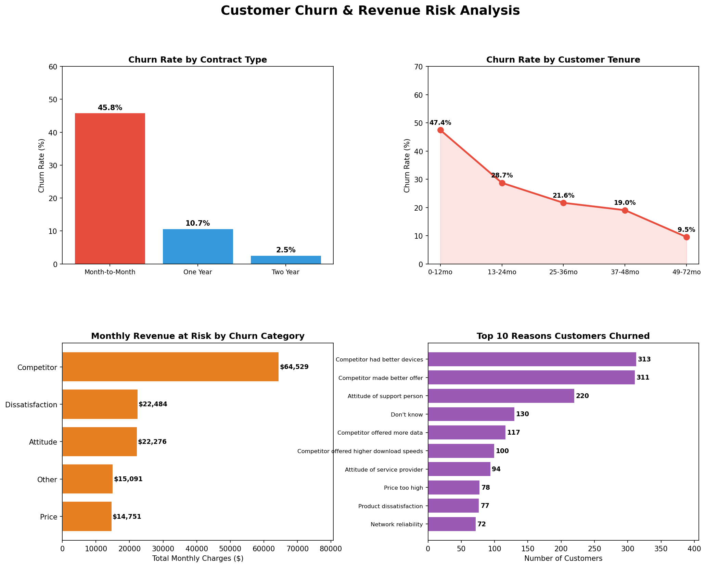
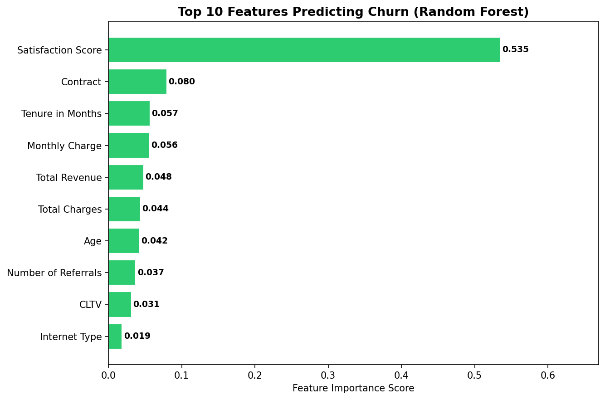

# Customer Churn & Revenue Risk Analysis

## Project Overview
Analyzed 7,043 telecom customers to identify churn drivers and quantify revenue at risk using Python, SQL, scikit-learn, and Tableau.

## 🔗 Live Dashboard
[View Interactive Tableau Dashboard](https://public.tableau.com/app/profile/yuktha.reddy.vanteru/viz/CustomerChurnRevenueRiskAnalysis_17800683902450/Dashboard1)

## Tools & Technologies
- Python (pandas, matplotlib, scikit-learn)
- SQL (SQLite — cohort queries, churn rate by segment)
- Machine Learning (Logistic Regression, Random Forest)
- Tableau Public (interactive dashboard)

## Key Findings
1. Month-to-month contracts churn at 45.8% vs only 2.5% for two-year contracts
2. $64,529/month in revenue is at risk from competitor-driven churn
3. Satisfaction Score is the top churn predictor (0.535 importance)
4. New customers (0–12 months) churn at 47.4%
5. Churned customers pay $74.44/month vs $61.27 for retained customers

## Machine Learning Results
| Model | AUC | Accuracy |
|---|---|---|
| Logistic Regression | 0.982 | 93% |
| Random Forest | 0.979 | 95% |

## Dashboard Preview

